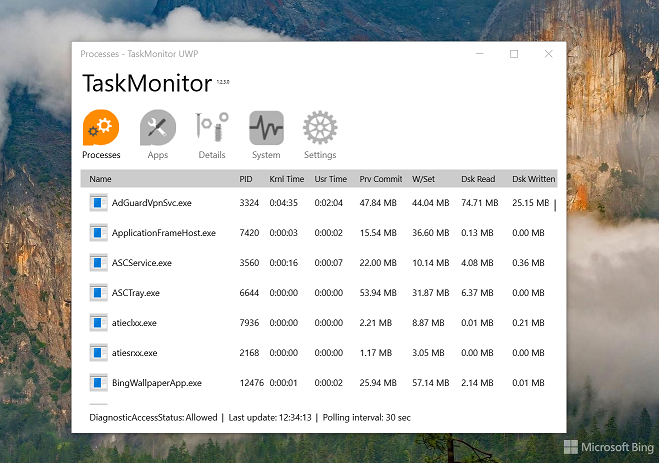
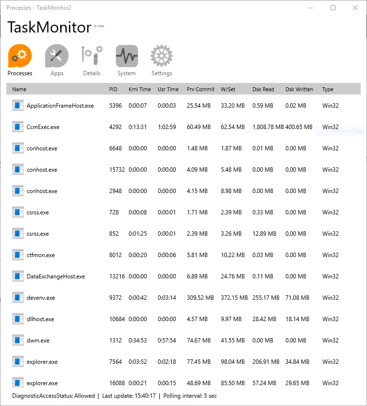
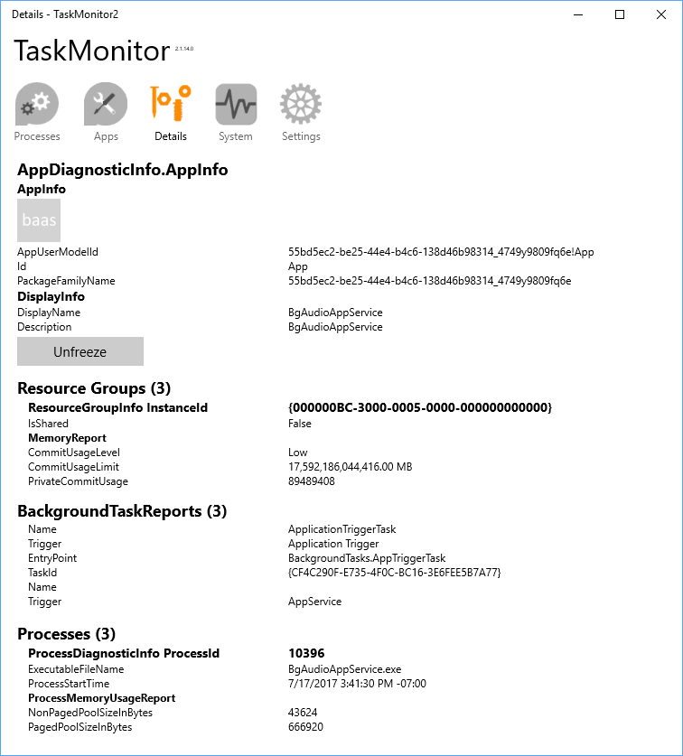
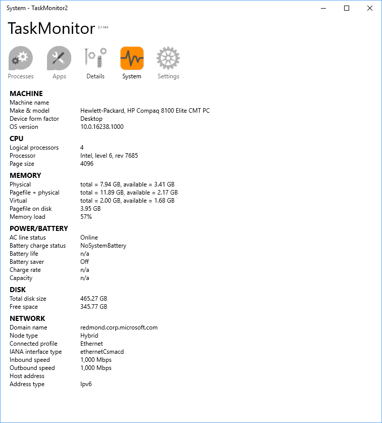
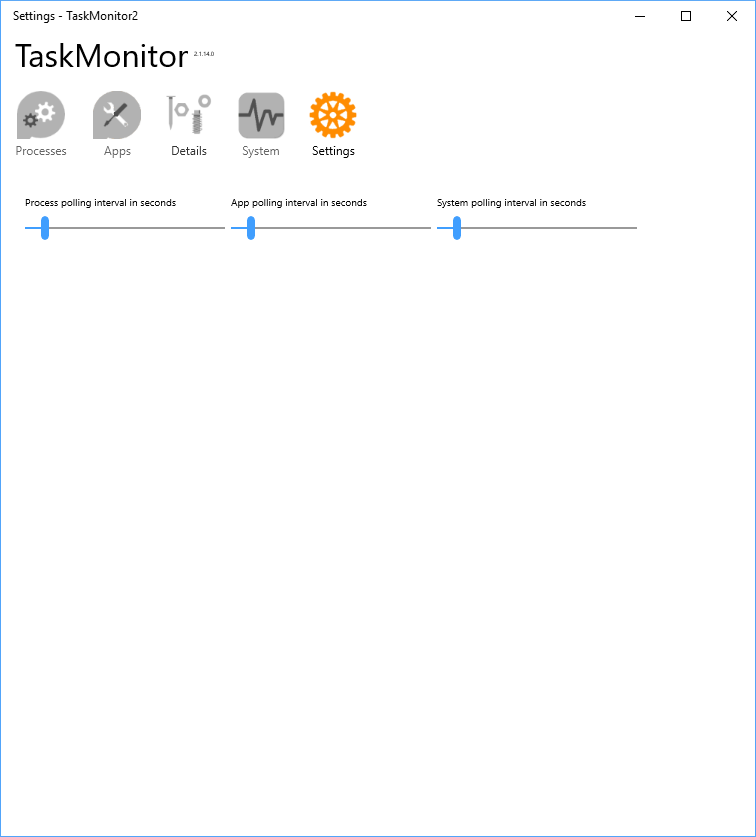

# TaskMonitorUWP
My fork of [UWPTaskMonitor app from Microsoft AppModel Samples](https://github.com/microsoft/AppModelSamples).

This sample accompanies the team blog post on 
[UWP App Diagnostics](https://blogs.windows.com/buildingapps/2017/06/28/uwp-app-diagnostics/).

The built app is also available in the [Store](https://www.microsoft.com/en-us/store/p/UWPTaskMonitor/9PNC4SL3XFHR).

## About / Description
UWP TaskMonitor is a Universal Windows App that provides much of the same functionality as the traditional Win32 Desktop Task Manager app. It exercises the new diagnostic APIs that are available in the Insiders builds, to gather diagnostic information on running apps (both Win32 and UWA), including resources usage (CPU, memory, disk, energy), execution state, background tasks, and so on.

## Screenshots

## Referencies
- https://apps.microsoft.com/store/detail/uwp-taskmonitor/9PNC4SL3XFHR?hl=en-us&gl=us -- MS Store 
- Andrew Whitechapel MSFT  --  MS Store publisher
- https://github.com/microsoft/AppModelSamples -- Microsoft AppModel Samples

## ..
AS IS. No support. RnD only.

## .
[m][e] 2022